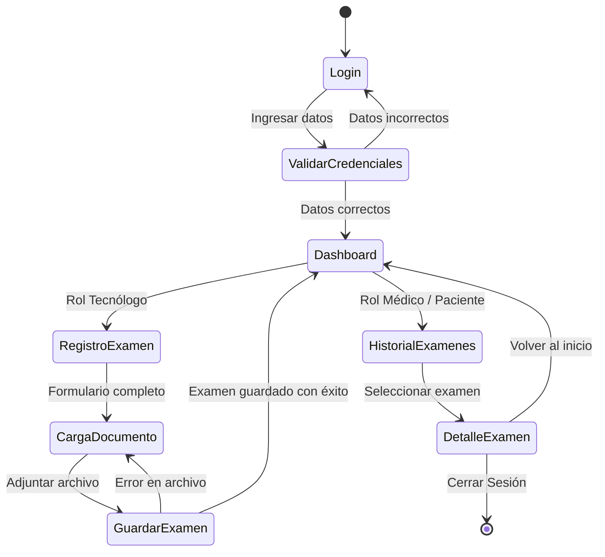

#OftApp - App Móvil para Consulta y Trazabilidad de Exámenes Oftalmológicos

## 📱 Propósito del Proyecto
**OftApp** es un MVP móvil desarrollado para la asignatura **DSY1105 (Desarrollo de Aplicaciones Móviles)** en Duoc UC Sede Puerto Montt, en colaboración con **MG Ingeniería Informática SPA**.

El objetivo principal es resolver la dispersión de exámenes oftalmológicos (campimetría, topografía, agudeza visual, etc.) que actualmente se guardan localmente en múltiples formatos (PDF, Excel, imágenes). OftApp permite centralizar, consultar y mantener la trazabilidad de los registros vinculados a una ficha digital ficticia por paciente.

---

## 🎨 Identidad Visual

### Logotipo

### Paleta de Colores
* **Principal (`#0066B2`):** Azul Médico/Clínico (Barras superiores y botones principales).
* **Secundario (`#00A896`):** Verde Teal (Acciones destacadas y confirmaciones).
* **Fondo (`#F8F9FA`):** Blanco Humo (Fondo general de la interfaz).
* **Texto (`#1A1C1E`):** Gris Oscuro (Alta legibilidad).
* **Estado Pendiente (`#FF9F1C`):** Naranja/Ámbar (Alertas de revisión).

---

## 🔄 Flujo de Usuario (Diagrama de Actividad)

---

## 🖥️ Pantallas Principales del MVP

* **Login (`login.png`):** Autenticación simulada y selección de rol (Paciente, Médico, Tecnólogo, Admin).
* **Dashboard (`dashboard.png`):** Panel principal adaptado según los permisos del usuario.
* **Registro de Examen (`registro-examen.png`):** Captura de atenciones clínicas y datos del procedimiento.
* **Carga de Documento (`carga-documento.png`):** Vinculación/simulación de adjuntos (PDF, imagen o tabla).
* **Historial / Listado (`historial.png`):** Consulta cronológica con filtros por fecha, tipo y estado.
* **Detalle de Examen (`detalle-examen.png`):** Ficha unificada, observaciones y visor de resultados.

---

## 👥 Integrantes del Equipo

* **Sebastián Valle** - Desarrollador Principal

---

## 🛠️ Tecnologías Utilizadas

* **Lenguaje:** Kotlin
* **Framework UI:** Jetpack Compose (Material Design 3)
* **Arquitectura:** MVVM (Model-View-ViewModel)
* **Persistencia:** Room / DataStore / JSON Local
